## 1.基础响应测试——登录

100并发

- 优化前，平均响应时间5196ms≈5s，大大超出了预期响应时间
	- 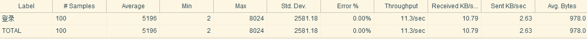
	- 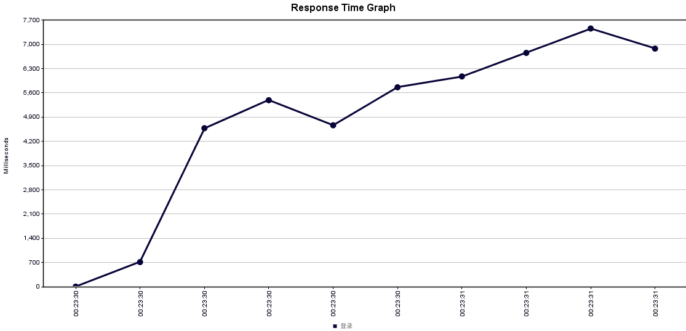
- 优化后，平均响应时间222ms，低于1s
	- 优化方式：数据库增加username和password索引；注释后端log输出信息（主要原因）
	- 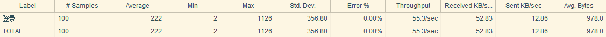
	- 

## 2. 基础登录登出处理

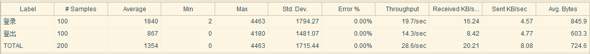

## 3. 学生主要操作流

100并发测试结果 【在homework表内给coursid和userid增加索引】

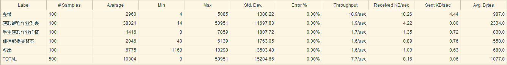

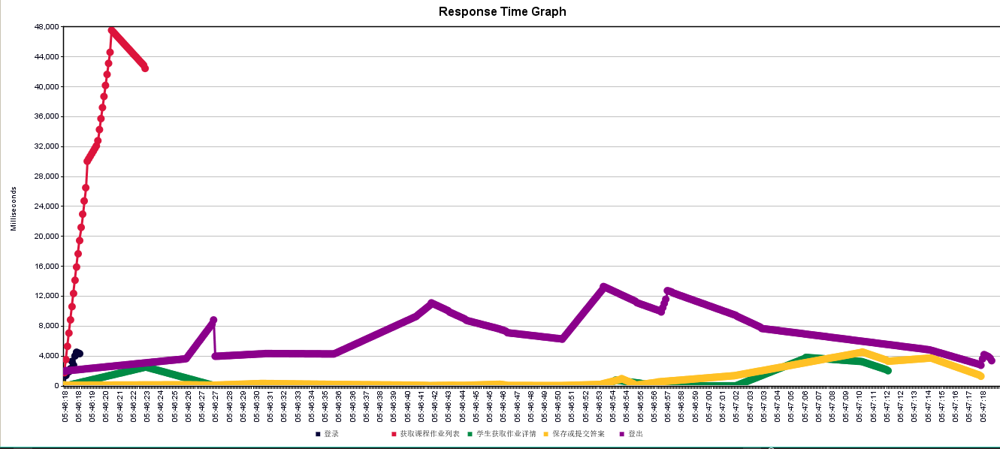

## 4.教师主要操作流

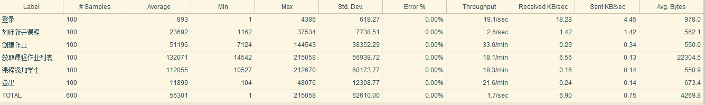

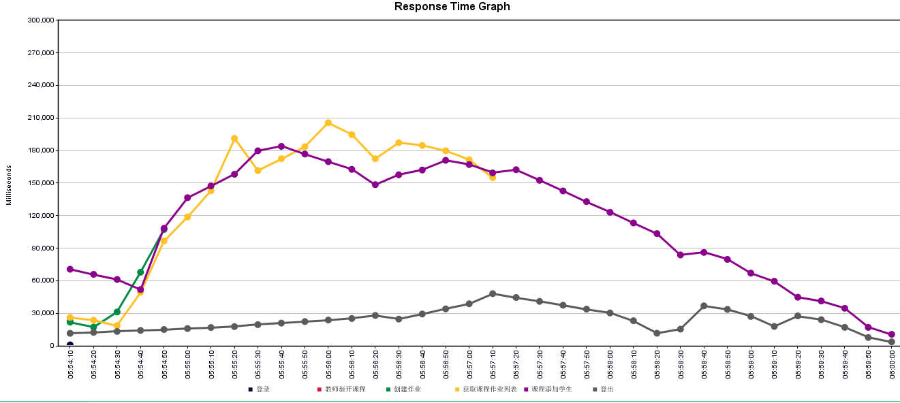

注释log后以及负载均衡后，更加稳定了

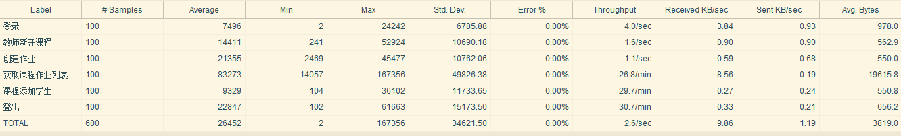

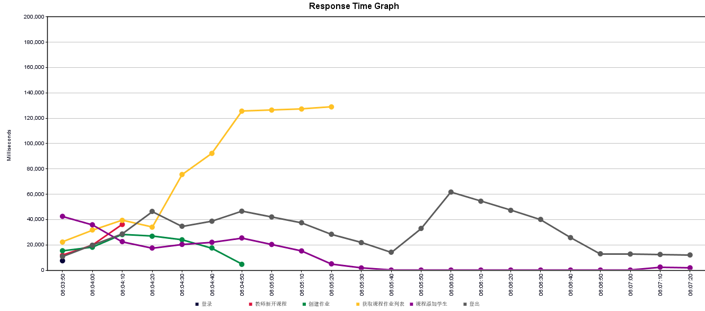

## 5. 极限抗压测试

1000并发login

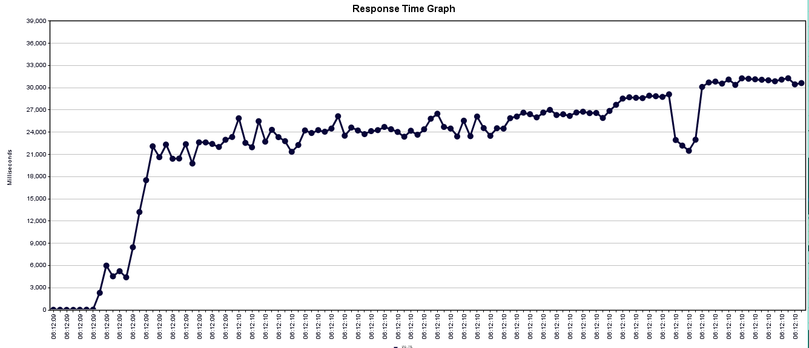

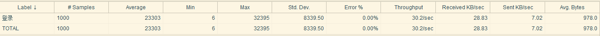